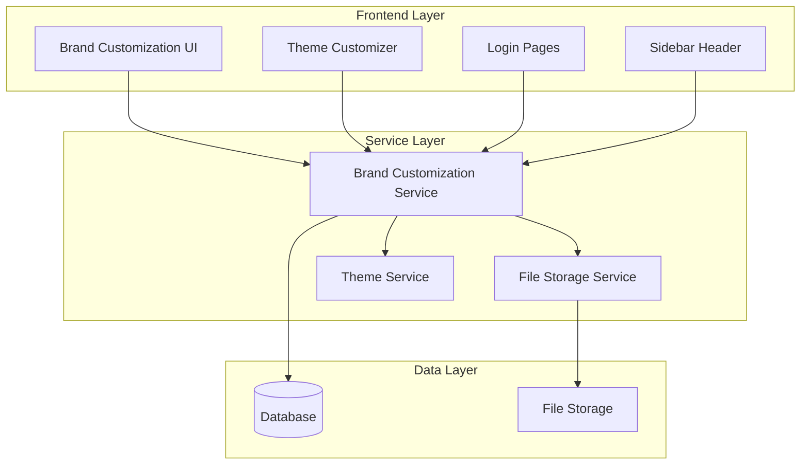
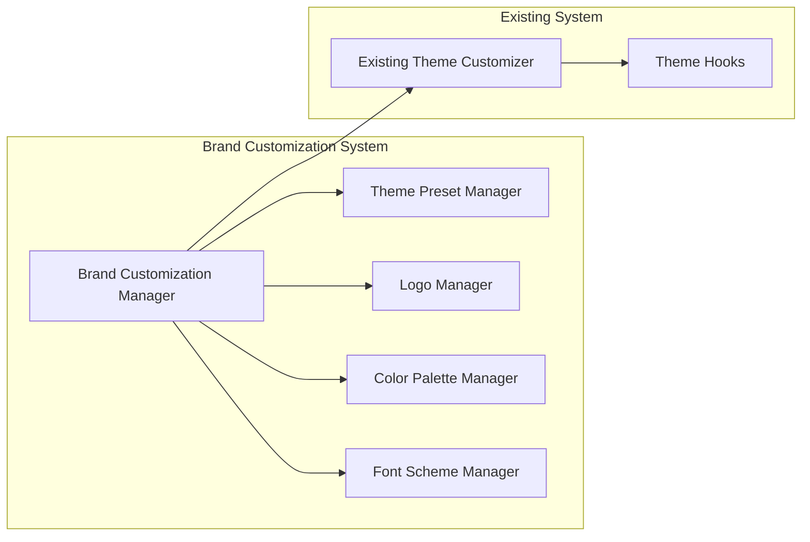

# Design Document

## Overview

O sistema de personalização de marca (Brand Customization) permite que cada empresa (tenant) customize a identidade visual da aplicação de acordo com sua marca corporativa. O sistema utiliza CSS Custom Properties (variáveis CSS) para aplicação dinâmica de temas, integra-se com o theme customizer existente e mantém isolamento completo entre diferentes tenants.

A arquitetura é baseada em três pilares principais:
1. **Armazenamento contextual por tenant** - Configurações salvas por empresa no banco de dados
2. **Aplicação dinâmica via CSS Custom Properties** - Mudanças em tempo real sem recarregamento
3. **Integração com sistema existente** - Extensão do theme customizer atual sem quebrar funcionalidades

## Architecture

### High-Level Architecture



### Component Architecture



## Components and Interfaces

### 1. Brand Customization Manager

**Responsabilidade**: Coordena todas as operações de personalização de marca e integração com o sistema existente.

```typescript
interface BrandCustomizationManager {
  // Carregamento de configurações
  loadTenantBranding(empresaId: string): Promise<TenantBranding>
  
  // Aplicação de temas
  applyTenantBranding(branding: TenantBranding): void
  
  // Persistência
  saveTenantBranding(empresaId: string, branding: TenantBranding): Promise<void>
  
  // Reset para padrão
  resetToDefault(empresaId: string): Promise<void>
}
```

### 2. Theme Preset Manager

**Responsabilidade**: Gerencia presets de tema personalizados e integração com presets existentes.

```typescript
interface ThemePresetManager {
  // Presets customizados
  createCustomPreset(empresaId: string, preset: CustomThemePreset): Promise<string>
  updateCustomPreset(presetId: string, preset: Partial<CustomThemePreset>): Promise<void>
  deleteCustomPreset(presetId: string): Promise<void>
  
  // Listagem
  getCustomPresets(empresaId: string): Promise<CustomThemePreset[]>
  getAllAvailablePresets(empresaId: string): Promise<ThemePreset[]>
}
```

### 3. Logo Manager

**Responsabilidade**: Gerencia upload, validação e aplicação de logos.

```typescript
interface LogoManager {
  // Upload e validação
  uploadLogo(empresaId: string, file: File, type: LogoType): Promise<LogoUploadResult>
  validateLogo(file: File): Promise<ValidationResult>
  
  // Aplicação
  applyLogo(empresaId: string, logoUrl: string, type: LogoType): void
  
  // Remoção
  removeLogo(empresaId: string, type: LogoType): Promise<void>
}

type LogoType = 'login' | 'sidebar' | 'favicon'
```

### 4. Color Palette Manager

**Responsabilidade**: Gerencia criação e aplicação de paletas de cores personalizadas.

```typescript
interface ColorPaletteManager {
  // Criação e edição
  createPalette(empresaId: string, palette: ColorPalette): Promise<string>
  updatePalette(paletteId: string, palette: Partial<ColorPalette>): Promise<void>
  
  // Aplicação
  applyPalette(palette: ColorPalette): void
  
  // Validação
  validateColorContrast(palette: ColorPalette): Promise<AccessibilityReport>
}
```

### 5. Font Scheme Manager

**Responsabilidade**: Gerencia esquemas de fontes personalizadas.

```typescript
interface FontSchemeManager {
  // Esquemas de fonte
  createFontScheme(empresaId: string, scheme: FontScheme): Promise<string>
  updateFontScheme(schemeId: string, scheme: Partial<FontScheme>): Promise<void>
  
  // Aplicação
  applyFontScheme(scheme: FontScheme): void
  
  // Google Fonts integration
  loadGoogleFont(fontFamily: string): Promise<void>
}
```

## Data Models

### TenantBranding

```typescript
interface TenantBranding {
  id: string
  empresaId: string
  
  // Logos
  logos: {
    login?: string
    sidebar?: string
    favicon?: string
  }
  
  // Paleta de cores
  colorPalette?: ColorPalette
  
  // Esquema de fontes
  fontScheme?: FontScheme
  
  // Configurações adicionais
  customCss?: string
  
  // Metadados
  createdAt: Date
  updatedAt: Date
  createdBy: string
  updatedBy: string
}
```

### ColorPalette

```typescript
interface ColorPalette {
  id: string
  name: string
  
  // Cores principais
  primary: string
  primaryForeground: string
  secondary: string
  secondaryForeground: string
  
  // Cores de apoio
  accent: string
  accentForeground: string
  muted: string
  mutedForeground: string
  
  // Cores de sistema
  background: string
  foreground: string
  card: string
  cardForeground: string
  
  // Cores de status
  destructive: string
  destructiveForeground: string
  
  // Sidebar específico
  sidebar: string
  sidebarForeground: string
  sidebarPrimary: string
  sidebarPrimaryForeground: string
  
  // Metadados
  isCustom: boolean
  createdAt: Date
  updatedAt: Date
}
```

### FontScheme

```typescript
interface FontScheme {
  id: string
  name: string
  
  // Fontes principais
  fontSans: string[]
  fontMono: string[]
  
  // Configurações de fonte
  fontSizes: {
    xs: string
    sm: string
    base: string
    lg: string
    xl: string
    '2xl': string
    '3xl': string
    '4xl': string
  }
  
  // Pesos de fonte
  fontWeights: {
    light: number
    normal: number
    medium: number
    semibold: number
    bold: number
  }
  
  // Metadados
  isCustom: boolean
  googleFonts: string[]
  createdAt: Date
  updatedAt: Date
}
```

### CustomThemePreset

```typescript
interface CustomThemePreset {
  id: string
  name: string
  empresaId: string
  
  // Referências
  colorPaletteId: string
  fontSchemeId?: string
  
  // Configurações do theme customizer existente
  radius: number
  scale: number
  mode: 'light' | 'dark'
  
  // Preview colors para UI
  previewColors: string[]
  
  // Metadados
  isDefault: boolean
  createdAt: Date
  updatedAt: Date
}
```

## Correctness Properties

*A property is a characteristic or behavior that should hold true across all valid executions of a system-essentially, a formal statement about what the system should do. Properties serve as the bridge between human-readable specifications and machine-verifiable correctness guarantees.*

Agora vou usar a ferramenta de prework para analisar os critérios de aceitação dos requisitos:

### Converting EARS to Properties

Baseado na análise de prework, converteremos os critérios de aceitação EARS em propriedades testáveis, eliminando redundâncias identificadas:

**Property 1: Logo Application Consistency**
*For any* uploaded logo and logo type (login/sidebar), when applied to a tenant, the logo should appear consistently across all relevant pages and user sessions for that tenant
**Validates: Requirements 1.1, 1.2, 1.5**

**Property 2: Logo Upload Validation**
*For any* file upload attempt, files exceeding size limits or unsupported formats should be rejected with appropriate error messages
**Validates: Requirements 1.3, 1.4**

**Property 3: Color Palette Real-time Application**
*For any* saved color palette, when applied to a tenant, all CSS custom properties should be updated immediately without requiring page refresh
**Validates: Requirements 2.3, 2.4**

**Property 4: Color Palette Editing Capability**
*For any* custom color palette, all color types (primary, secondary, accent, background) should be editable through the interface
**Validates: Requirements 2.2**

**Property 5: Accessibility Compliance Validation**
*For any* color palette, the system should validate color contrast ratios and ensure accessibility compliance
**Validates: Requirements 2.5**

**Property 6: Font Scheme Application**
*For any* selected font scheme, it should be applied to all text elements in the interface without requiring page refresh
**Validates: Requirements 3.1, 3.5**

**Property 7: Font Support and Fallbacks**
*For any* custom font selection, the system should support web-safe fonts and Google Fonts with proper fallback configuration
**Validates: Requirements 3.2, 3.3**

**Property 8: Tenant-Specific Customization Loading**
*For any* user login, the system should load and apply customizations specific to their empresa automatically
**Validates: Requirements 4.1**

**Property 9: Multi-Tenant Isolation and Consistency**
*For any* empresa, customizations should be isolated from other empresas while being consistent for all users within the same empresa
**Validates: Requirements 4.2, 4.3, 4.4**

**Property 10: Default Branding Fallback**
*For any* empresa without custom branding, the system should apply default system branding
**Validates: Requirements 4.5**

**Property 11: Real-time Preview Functionality**
*For any* customization changes, the system should provide real-time preview before application
**Validates: Requirements 5.2**

**Property 12: Customization State Management**
*For any* customization session, the system should allow saving, resetting to defaults, or canceling modifications with appropriate state restoration
**Validates: Requirements 5.3, 5.5**

**Property 13: Validation Feedback**
*For any* uploaded asset or color choice, the system should provide appropriate validation feedback
**Validates: Requirements 5.4**

**Property 14: Theme Customizer Integration**
*For any* access to the existing theme customizer, tenant-specific options should be available while maintaining compatibility with existing presets
**Validates: Requirements 6.1, 6.2**

**Property 15: Settings Hierarchy Management**
*For any* theme modification, the system should distinguish between personal preferences and empresa-wide branding, prioritizing empresa branding for brand-related elements
**Validates: Requirements 6.3, 6.5**

**Property 16: Existing Functionality Preservation**
*For any* existing theme functionality (dark/light mode, radius, scale), it should continue working while new branding features are added
**Validates: Requirements 6.4**

**Property 17: Access Control Validation**
*For any* brand customization access attempt, the system should verify empresa admin privileges and deny unauthorized access gracefully
**Validates: Requirements 7.1, 7.5**

**Property 18: Secure File Processing**
*For any* file upload, the system should validate for security threats, sanitize filenames, and store files securely
**Validates: Requirements 7.2, 7.3**

**Property 19: Upload Rate Limiting**
*For any* series of file upload attempts, the system should implement rate limiting to prevent abuse
**Validates: Requirements 7.4**

## Error Handling

### File Upload Errors

1. **Size Limit Exceeded**: Display clear error message with maximum allowed size
2. **Invalid Format**: Show supported formats and reject unsupported files
3. **Security Threats**: Log security violations and reject malicious files
4. **Storage Failures**: Provide fallback mechanisms and user notification

### Theme Application Errors

1. **CSS Property Conflicts**: Resolve conflicts with existing theme system gracefully
2. **Invalid Color Values**: Validate color formats and provide correction suggestions
3. **Font Loading Failures**: Implement fallback fonts and retry mechanisms
4. **Real-time Update Failures**: Provide manual refresh option and error notification

### Database Persistence Errors

1. **Connection Failures**: Implement retry logic and temporary local storage
2. **Validation Errors**: Provide detailed feedback on data validation failures
3. **Concurrent Modifications**: Handle conflicts with optimistic locking
4. **Rollback Scenarios**: Provide mechanisms to revert to previous working state

### Access Control Errors

1. **Unauthorized Access**: Log attempts and redirect to appropriate error page
2. **Session Expiration**: Handle gracefully with re-authentication prompt
3. **Permission Changes**: Update UI dynamically when permissions change
4. **Rate Limiting**: Provide clear feedback when limits are exceeded

## Testing Strategy

### Dual Testing Approach

O sistema utilizará uma abordagem dupla de testes para garantir cobertura abrangente:

**Unit Tests**: Focarão em exemplos específicos, casos extremos e condições de erro:
- Validação de formatos de arquivo específicos
- Casos extremos de tamanhos de arquivo
- Integração entre componentes
- Condições de erro específicas

**Property-Based Tests**: Verificarão propriedades universais através de muitas entradas geradas:
- Aplicação consistente de customizações através de diferentes tenants
- Validação de uploads com arquivos gerados aleatoriamente
- Isolamento multi-tenant com dados gerados
- Persistência e recuperação de configurações

### Property-Based Testing Configuration

- **Framework**: fast-check (para TypeScript/JavaScript)
- **Iterações mínimas**: 100 por teste de propriedade
- **Formato de tag**: **Feature: brand-customization, Property {number}: {property_text}**
- Cada propriedade de correção será implementada por um único teste de propriedade
- Testes serão executados em pipeline CI/CD para validação contínua

### Test Data Generation

**Logo Upload Testing**:
- Geração de arquivos de diferentes tamanhos e formatos
- Criação de nomes de arquivo com caracteres especiais
- Simulação de arquivos corrompidos ou maliciosos

**Color Palette Testing**:
- Geração de paletas de cores aleatórias
- Teste de combinações de cores para acessibilidade
- Validação de formatos de cor (hex, rgb, hsl)

**Font Scheme Testing**:
- Teste com diferentes famílias de fontes
- Validação de fallbacks para fontes não disponíveis
- Teste de carregamento de Google Fonts

**Multi-Tenant Testing**:
- Geração de múltiplos tenants com configurações diferentes
- Teste de isolamento entre tenants
- Validação de aplicação consistente por tenant